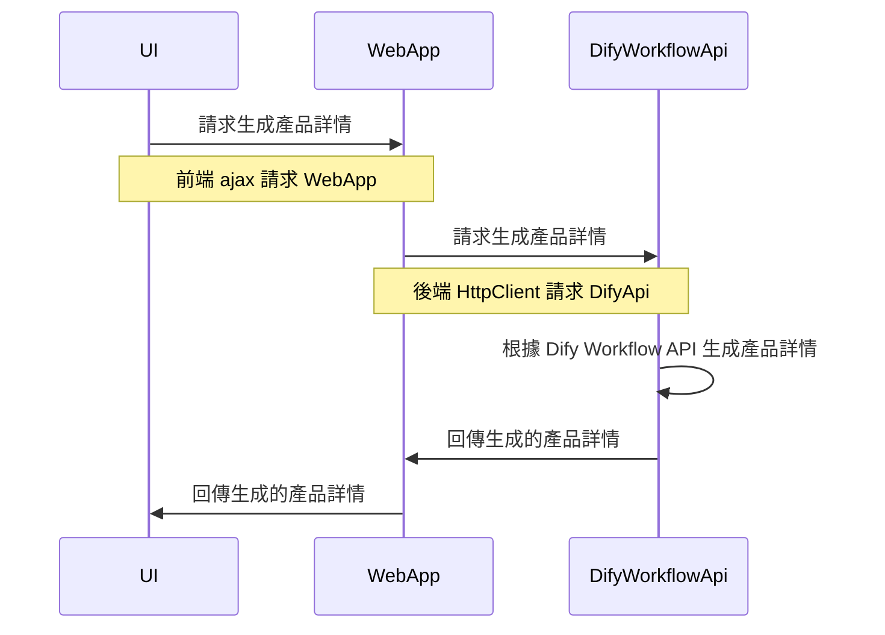

# Dotnet8 MVC Integrate Dify Workflow Api

## Git Repository
- https://github.com/weberyanglalala/Dotnet8DifyAgentSample

## Create UI


## Flow



## Http Request
> https://weberyanglalala.github.io/vitpress-dev-notes/ai/openai/document-outline#client-and-server

> https://developer.mozilla.org/en-US/docs/Web/HTTP/Overview#http_flow

> https://developer.mozilla.org/en-US/docs/Web/HTTP/Overview#requests

## Dify Workflow API Documentation


### Request Headers
> Authorization
- https://developer.mozilla.org/en-US/docs/Web/HTTP/Headers

### Request Body

`inputs`(物件) 必填 允許輸入應用程式定義的各種變數值。`inputs`參數包含多個鍵/值對，每個鍵對應於特定變數，每個值是該變數的具體值。工作流程應用程式至少需要輸入一個鍵/值對。

- `response_mode`(字串) 必填 回應返回模式，支持：
  - `streaming`串流模式（推薦），通過SSE（[伺服器推送事件](https://developer.mozilla.org/en-US/docs/Web/API/Server-sent_events/Using_server-sent_events)）實現類似打字機的輸出。
  - `blocking`阻塞模式，執行完成後返回結果。 （如果過程較長，請求可能會被中斷）_由於Cloudflare的限制，請求在100秒後會被中斷而不返回。_

- `user`(字串) 必填 用戶識別碼，用於定義最終用戶的身份以便檢索和統計。應由開發人員在應用程式中唯一定義。

- `files`(陣列[物件]) 可選 檔案列表，適合與文本理解和回答問題相結合的檔案（圖像）輸入，僅在模型支持視覺能力時可用。
  - `type`(字串) 支持的類型：`image`（目前僅支持圖像類型）
  - `transfer_method`(字串) 傳輸方式，`remote_url`用於圖像URL / `local_file`用於檔案上傳
  - `url`(字串) 圖像URL（當傳輸方式為`remote_url`時）
  - `upload_file_id`(字串) 上傳檔案ID，必須通過檔案上傳API提前上傳獲得（當傳輸方式為`local_file`時）

## Workflow Api Request Sample(Blocking mode)
> What is curl?
```
curl -X POST 'http://dify.local/v1/workflows/run' \
--header 'Authorization: Bearer {api_key}' \
--header 'Content-Type: application/json' \
--data-raw '{
    "inputs": {},
    "response_mode": "blocking",
    "user": "abc-123"
}'
```

## Workflow Api Request Sample(Blocking mode)

```json
{
    "workflow_run_id": "djflajgkldjgd",
    "task_id": "9da23599-e713-473b-982c-4328d4f5c78a",
    "data": {
        "id": "fdlsjfjejkghjda",
        "workflow_id": "fldjaslkfjlsda",
        "status": "succeeded",
        "outputs": {
          "text": "Nice to meet you."
        },
        "error": null,
        "elapsed_time": 0.875,
        "total_tokens": 3562,
        "total_steps": 8,
        "created_at": 1705407629,
        "finished_at": 1727807631
    }
}
```

## Postman
- Collection
- Environment Variables
- get api key from backend


```
curl --location 'http://dify.local/v1/workflows/run' \
--header 'Content-Type: application/json' \
--header 'Authorization: Bearer <.....>' \
--data '{
    "inputs": {
        "product_name": "宜蘭礁溪五日遊"
    },
    "response_mode": "blocking",
    "user": "abc-123"
}'
```

## Create Dify Workflow Api Service
> 透過 [JsonPropertyName("inputs")] 來指定輸入的參數名稱

### Generate Dto For Request

- https://agent.build-school.com/chat/yZOtmUvPnILCUuvV


### Generate Dto For Response

**CompletionResponse**
返回App結果，`Content-Type`為`application/json`。
* `workflow_run_id` (字串) 工作流程執行的唯一ID
* `task_id` (字串) 任務ID，用於請求追蹤和以下的停止生成API
* `data` (物件) 結果詳情
  * `id` (字串) 工作流程執行的ID
  * `workflow_id` (字串) 相關工作流程的ID
  * `status` (字串) 執行狀態，`running` / `succeeded` / `failed` / `stopped`
  * `outputs` (json) 可選的輸出內容
  * `error` (字串) 可選的錯誤原因
  * `elapsed_time` (浮點數) 可選的總使用秒數
  * `total_tokens` (整數) 可選的使用令牌數
  * `total_steps` (整數) 預設為0
  * `created_at` (時間戳) 開始時間
  * `finished_at` (時間戳) 結束時間

### Set up Environment Variables for Dify Workflow Api

```json
{
  "Logging": {
    "LogLevel": {
      "Default": "Information",
      "Microsoft.AspNetCore": "Warning"
    }
  },
  "AllowedHosts": "*",
  "DifyWorkFlowApiEndpoint": "",
  "DifyCreateProductDetailApiKey": "",
  "DifyUserId": "local-dev-test",
  "OpenAIApiKey": "",
  "Serilog": {
    "Using": [
      "Serilog.Sinks.Console"
    ],
    "MinimumLevel": {
      "Default": "Error",
      "Override": {
        "Microsoft": "Error"
      }
    },
    "WriteTo": [
      {
        "Name": "Console"
      }
    ],
    "Enrich": [
      "FromLogContext",
      "WithMachineName",
      "WithProcessId",
      "WithThreadId"
    ],
    "Properties": {
      "Application": "Dify Web App",
      "Environment": "Development"
    }
  }
}

```

### DifyCreateProductService

- https://learn.microsoft.com/zh-tw/dotnet/core/extensions/httpclient-factory

```csharp
using System.Net.Http.Headers;
using System.Text;
using System.Text.Json;
using Dotnet8DifyAgentSample.Services.DifyWorkflow.Dtos;

namespace Dotnet8DifyAgentSample.Services.DifyWorkflow;

public class DifyCreateProductService
{
    private readonly string _difyApiUrl;
    private readonly string _difyCreateProductDetailApiKey;
    private readonly IHttpClientFactory _httpClientFactory;

    public DifyCreateProductService(IConfiguration configuration, IHttpClientFactory httpClientFactory)
    {
        _difyApiUrl = configuration["DifyWorkFlowApiEndpoint"];
        _difyCreateProductDetailApiKey = configuration["DifyCreateProductDetailApiKey"];
        _httpClientFactory = httpClientFactory;
    }

    public async Task<DifyWorkflowResponse> CreateProductDetail(CreateProductRequest request)
    {
        // var client = new HttpClient();
        var client = _httpClientFactory.CreateClient();
        
        // setup headers
        client.DefaultRequestHeaders.Authorization =
            new AuthenticationHeaderValue("Bearer", _difyCreateProductDetailApiKey);

        // set up request endpoint
        var endpoint = $"{_difyApiUrl}/workflows/run";
        
        // set up request content
        var jsonContent = JsonSerializer.Serialize(request);
        var content = new StringContent(jsonContent, Encoding.UTF8, "application/json");

        var response = await client.PostAsync(endpoint, content);

        if (response.IsSuccessStatusCode)
        {
            // read response content
            var result = await response.Content.ReadAsStringAsync();
            // deserialize response content
            var runWorkflowResponse = JsonSerializer.Deserialize<DifyWorkflowResponse>(result);
            
            // 也可以這樣寫
            // var runWorkflowResponse = await response.Content.ReadFromJsonAsync<DifyWorkflowResponse>();
            return runWorkflowResponse;
        }
        else
        {
            var errorResponse = await response.Content.ReadAsStringAsync();
            throw new Exception($"Error running workflow: {errorResponse}");
        }
    }
}
```

### Create A BaseApiResponse

```csharp
namespace Dotnet8DifyAgentSample.Models;

public class ApiResponse
{
    public bool IsSuccess { get; set; }
    public ApiStatusCode Code { get; set; }
    public object Body { get; set; }
}

public enum ApiStatusCode
{
    Success = 200,
    Error = 500
}
```

### Create API Controller

```csharp
using Dotnet8DifyAgentSample.Models;
using Dotnet8DifyAgentSample.Models.Dtos;
using Dotnet8DifyAgentSample.Services.DifyWorkflow;
using Dotnet8DifyAgentSample.Services.DifyWorkflow.Dtos;
using Microsoft.AspNetCore.Mvc;

namespace Dotnet8DifyAgentSample.WebApi;

[Route("api/[controller]/[action]")]
[ApiController]
public class DifyController : ControllerBase
{
    private readonly DifyCreateProductService _difyCreateProductService;
    private readonly string _difyUserId;
    private readonly ILogger<DifyController> _logger;

    public DifyController(DifyCreateProductService difyCreateProductService, IConfiguration configuration,
        ILogger<DifyController> logger)
    {
        _difyCreateProductService = difyCreateProductService;
        _difyUserId = configuration["DifyUserId"];
        _logger = logger;
    }

    [HttpPost]
    public async Task<IActionResult> CreateProductDetail([FromBody] CreateWorkflowRequest request)
    {
        // set up inputs
        var inputs = new Dictionary<string, object>();
        inputs.Add("product_name", request.ProductName);
        var runWorkflowRequest = new CreateProductRequest
        {
            Inputs = inputs,
            ResponseMode = "blocking",
            User = _difyUserId
        };
        
        try
        {
            // call dify workflow service
            var response = await _difyCreateProductService.CreateProductDetail(runWorkflowRequest);
            
            // return success response
            var apiResponse = new ApiResponse
            {
                IsSuccess = true,
                Code = ApiStatusCode.Success,
                Body = response.Data.Outputs
            };
            return Ok(apiResponse);
        }
        catch (Exception e)
        {
            _logger.LogError(e, "An error occurred while creating the workflow.");
            // return error response
            var apiResponse = new ApiResponse
            {
                IsSuccess = false,
                Code = ApiStatusCode.Error,
                Body = "An error occurred while processing your request."
            };
            return Ok(apiResponse);
        }
    }
}
```
