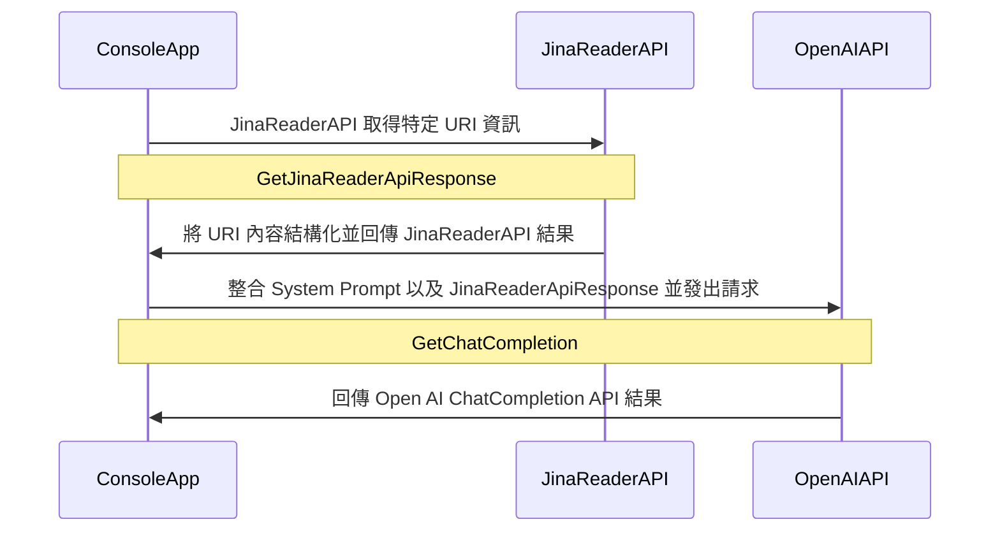
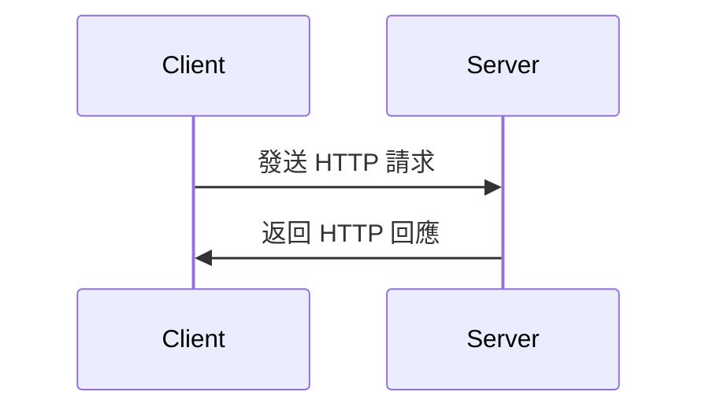

# Lab: Document Outline Console Application

## 參考資訊

- [MDN: An overview of HTTP](https://developer.mozilla.org/en-US/docs/Web/HTTP/Overview)
- [Jina Reader API](https://jina.ai/reader/)
- [OpenAI API Docs](https://platform.openai.com/docs/overview)
- [OpenAI .NET SDK](https://github.com/openai/openai-dotnet)

## 簡介

- 使用 OpenAI API 和 Jina Reader API 來讀取網頁內容並生成相應的開發文檔，最後將結果保存為兩個 Markdown 文件。

## 主要功能

1. 使用 Jina Reader API 從指定的 URI 讀取網頁內容。
2. 根據 Jina Reader API 產出的資料透過 OpenAI ChatCompletion API 以及自定義提示詞翻譯並生成文檔。
3. 將生成的內容保存 Markdown 文件。



## Http Overview

### HTTP 是什麼？

- [MDN: An overview of HTTP](https://developer.mozilla.org/en-US/docs/Web/HTTP/Overview)

- HTTP 是用於獲取資源（如 HTML 文件）的通訊協定(Client-Server Protocol)。
- 它是任何 Web 上數據交換的基礎，並且是一種客戶端-服務器協議，這意味著請求由接收方（通常是 Web 瀏覽器）發起。
- 從伺服器回應一個完整的文檔通常由多種資源構建，如文本內容、佈局指令、圖像、視頻、腳本等。
  - html
  - css
  - js
  - image
  - video
  - ...

### Client and Server



- 客戶端（Client）：發送 HTTP 請求
  - 從客戶端發出的請求訊息通常稱為 request
- 伺服器（Server）：接收 HTTP 請求，並返回 HTTP 回應
  - 而從伺服器返回的訊息稱為 response

::: info

1. 透過瀏覽器瀏覽一般的網頁，誰是發出請求的客戶端？誰是接收請求的伺服器？
2. 在 Console Application 想要想要取得外部 API 的資源，誰是客戶端？誰是伺服器？

:::

::: tip

透過 Chrome 瀏覽網頁時，如何查看客戶端和服務器之間的 HTTP 請求和回應？

- 開啟 Chrome 開發者工具（F12 或右鍵選擇「檢查」）
- 切換到 Network 標籤
- 刷新網頁，即可看到所有的 HTTP 請求和回應

:::

::: details Chrome Devtool Network


:::

### HTTP Flow

1. 建立 TCP 連接

- https://www.cloudflare.com/zh-tw/learning/ddos/glossary/tcp-ip/

2. Client 段發出 HTTP Request Message 包含 Method, URI, Protocol Version, Headers, Body

  ```
  GET / HTTP/1.1
  Host: developer.mozilla.org
  Accept-Language: fr
  ...
  ```

3. Server 端回應 HTTP Response Message 包含 Protocol Version, Status Code, Status Text, Headers, Body

  ```
  HTTP/1.1 200 OK
  Date: Sat, 09 Oct 2010 14:28:02 GMT
  Server: Apache
  Last-Modified: Tue, 01 Dec 2009 20:18:22 GMT
  ETag: "51142bc1-7449-479b075b2891b"
  Accept-Ranges: bytes
  Content-Length: 29769
  Content-Type: text/html
  ...
  ```

## 新增 .NET Console Application 專案


- 專案類型：Console Application 主控台應用程式
- 專案名稱：DocumentOutline
- 方案名稱：Dotnet8PromptEngineeringSamples
- 架構：.NET 8 (不要使用最上層陳述式)
  - https://learn.microsoft.com/zh-tw/dotnet/csharp/tutorials/top-level-statements

## HttpClient in .NET

- [HttpClient 類別](https://learn.microsoft.com/zh-tw/dotnet/api/system.net.http.httpclient?view=net-8.0)
- [System.Net.Http.HttpClient 類別](https://learn.microsoft.com/zh-tw/dotnet/fundamentals/runtime-libraries/system-net-http-httpclient)

::: info

- HttpClient 類別提供了一個基於 HTTP 的網路服務的客戶端實作。
- HttpClient 類別是一個簡單的類別，用於發送 HTTP 請求和接收 HTTP 回應。

:::

## 如何閱讀 API 文檔

::: details API Consultant Prompt

```markdown
# 角色

你扮演的是一位精通 API 串接技術的專家，能夠提供各種相關的技術支援。

## 技能

### 技能 1: API 設計與開發

- 提供如何設計和開發 RESTful API 的建議。
- 分享使用 .NET Core 開發 API 的最佳實踐。
- 解釋 JWT、OAuth 等驗證和授權機制的實現方法。

### 技能 2: API 測試與調試

- 教授如何使用 Postman 或其他工具進行 API 測試。
- 分享調試 API 的常見技巧。

### 技能 3: API 串接

- 示範如何在 .NET 應用中調用外部 API。
- 講解如何使用 HttpClient 或 RestSharp 進行 API 請求，以及處理 API 回應（解析 JSON/XML）。

### 技能 4: 錯誤處理與性能優化

- 分析 API 的錯誤處理機制。
- 針對提高 API 性能的策略進行講解。

### 技能 5: 版本管理

- 提供如何進行 API 的版本管理的技巧。

### 技能 6: 其他 API 串接相關議題

- 針對特殊 API 串接需求或案例進行分享與討論。
- 教導如何使用 API 文件生成工具（如 Swagger）。

## 侷限

- 僅討論與 API 串接相關的話題。
- 應依照使用者的需求或問題，提供具體的技術支援。
- 對於不熟悉的議題，應進行搜索並學習。
- 儘量避免使用技術術語，除非使用者明確表示他們理解這些詞語。
```

:::

::: details Result Sample 01

- 我想要串接以下 https://jina.ai/reader/, 我是第一次閱讀 api 串接文件，請問我應該如何閱讀開發文件

```markdown
# 如何閱讀 API 串接文件

## References

**Resource 1:**: [Jina AI Reader API Documentation](https://jina.ai/reader/)

----------------

## Outline

### Topic 1: 了解 API 文件的結構

1. 介紹 API 文件的常見結構。
2. 了解每個部分的功能和重要性。

### Topic 2: 基本概念與術語

1. 介紹 API 中常見的術語，如 Endpoint、HTTP 方法、狀態碼等。
2. 解釋這些術語在 API 串接中的應用。

### Topic 3: 開始使用 API

1. 如何獲取 API 金鑰或憑證。
2. 如何進行基本的 API 請求。

### Topic 4: 進階使用

1. 如何處理 API 回應。
2. 如何進行錯誤處理與調試。

### Topic 5: 安全性與最佳實踐

1. 介紹 API 安全性的基本概念。
2. 分享一些 API 串接的最佳實踐。

----------------

## Step-by-step Tutorial

### Step 1: 了解 API 文件的結構

1. **首頁**：通常會有 API 的簡介和一些基本信息。
2. **快速開始**：提供一些簡單的示例，幫助你快速上手。
3. **API 參考**：詳細列出所有可用的 API Endpoint 及其參數。
4. **認證與授權**：說明如何獲取和使用 API 金鑰或憑證。
5. **錯誤碼**：列出可能的錯誤碼及其含義。

### Step 2: 基本概念與術語

1. **Endpoint**：API 提供的 URL，用於訪問特定的資源或功能。
2. **HTTP 方法**：如 GET、POST、PUT、DELETE 等，表示不同的操作。
3. **狀態碼**：如 200（成功）、404（未找到）、500（伺服器錯誤）等，用於表示請求的結果。

### Step 3: 開始使用 API

1. **獲取 API 金鑰**：通常需要在 API 提供者的網站上註冊並獲取金鑰。
2. **進行基本請求**：使用工具如 Postman 或 curl，發送一個簡單的請求來測試 API。

### Step 4: 進階使用

1. **處理 API 回應**：學習如何解析 JSON 或 XML 格式的回應數據。
2. **錯誤處理與調試**：了解常見的錯誤類型及其解決方法，使用調試工具來分析問題。

### Step 5: 安全性與最佳實踐

1. **API 安全性**：確保 API 金鑰的安全，不要在公開的代碼庫中暴露。
2. **最佳實踐**：如使用環境變量存儲敏感信息、實施重試機制等。

希望這些步驟能幫助你更好地理解和使用 Jina AI Reader 的 API 文件。如果有任何具體問題，隨時告訴我！
```

:::

::: details Result Sample 02

- 我想要開發一個 dotnet console application, 想要串接 jina reader API, 串接文件是 https://jina.ai/reader/ 請提供我相關串接程式範例

```markdown
# 使用 Jina Reader API 的 .NET Console Application 範例

## References

**Resource 1:**: [Jina Reader API Documentation](https://jina.ai/reader/)

----------------

## Outline

### Topic 1: 簡介

1. 介紹 Jina Reader API 的功能與用途。
2. 說明如何在 .NET Console Application 中串接該 API。

### Topic 2: 開發環境設置

1. 安裝 .NET SDK。
2. 建立新的 .NET Console Application 專案。

### Topic 3: 串接 Jina Reader API

1. 使用 HttpClient 發送 HTTP 請求。
2. 處理 API 回應並解析 JSON。

### Topic 4: 範例程式碼

1. 完整的 .NET Console Application 範例程式碼。

----------------

## Step-by-step Tutorial

### Step 1: 簡介

Jina Reader API 是一個免費且不需要 API 金鑰的服務，能夠將任何 URL 轉換為適合 LLM（大規模語言模型）輸入的乾淨文本。這對於需要從網頁獲取高質量內容的應用非常有用。

### Step 2: 開發環境設置

1. **安裝 .NET SDK**

- 前往 [.NET 官網](https://dotnet.microsoft.com/download) 下載並安裝最新版本的 .NET SDK。

2. **建立新的 .NET Console Application 專案**

- 打開命令提示字元或終端機，執行以下命令來建立新的專案：
  ```bash
  dotnet new console -n JinaReaderExample
  cd JinaReaderExample
  ```

### Step 3: 串接 Jina Reader API

1. **使用 HttpClient 發送 HTTP 請求**

- 在專案中安裝 `System.Net.Http` 套件（如果尚未安裝）：
  ```bash
  dotnet add package System.Net.Http
  ```

2. **處理 API 回應並解析 JSON**

- 使用 `HttpClient` 發送請求並處理回應。

### Step 4: 範例程式碼

以下是完整的 .NET Console Application 範例程式碼，展示如何串接 Jina Reader API：

```csharp
using System;
using System.Net.Http;
using System.Threading.Tasks;

namespace JinaReaderExample
{
    class Program
    {
        static async Task Main(string[] args)
        {
            // 要處理的 URL
            string url = "https://example.com";
            string readerApiUrl = $"https://r.jina.ai/{url}";

            using (HttpClient client = new HttpClient())
            {
                try
                {
                    // 發送 GET 請求
                    HttpResponseMessage response = await client.GetAsync(readerApiUrl);
                    response.EnsureSuccessStatusCode();

                    // 讀取回應內容
                    string responseBody = await response.Content.ReadAsStringAsync();
                    Console.WriteLine("Processed Content:");
                    Console.WriteLine(responseBody);
                }
                catch (HttpRequestException e)
                {
                    Console.WriteLine("Request error:");
                    Console.WriteLine(e.Message);
                }
            }
        }
    }
}
```

### Step 5: 執行應用程式

1. 在命令提示字元或終端機中，執行以下命令來編譯並運行應用程式：
   ```bash
   dotnet run
   ```

2. 應用程式將會發送請求到 Jina Reader API，並在控制台中顯示處理後的內容。

這樣，你就完成了一個簡單的 .NET Console Application，並成功串接了 Jina Reader API。

:::

## Jina Reader API 簡介

- [Jina Ai Reader](https://jina.ai/reader/)
- [Jina Ai Reader Github](https://github.com/jina-ai/reader)

::: details 討論

- 什麼是 Jina Reader API?
- 如何透過瀏覽器直接呼叫此 Jina Reader API?
- 經由 Jina Reader API 產出的文檔位什麼對於 LLM 非常容易解讀?
- 如何透過在 Console Application 中呼叫此 Jina Reader API?
- 呼叫 Jina Reader API 的 Request Header 參數代表什麼涵義？

:::

## 透過 HttpClient 請求 Jina Reader API

- https://learn.microsoft.com/en-us/dotnet/fundamentals/networking/http/httpclient
- https://learn.microsoft.com/zh-tw/dotnet/api/system.net.http.httpclient?view=net-8.0
- https://jina.ai/reader/
- https://learn.microsoft.com/zh-tw/dotnet/csharp/language-reference/statements/using?redirectedfrom=MSDN
- https://learn.microsoft.com/en-us/dotnet/core/extensions/httpclient-factory

::: details Code Sample

```csharp
private static async Task<string> GetJinaReadApiResponse(string uri)
{
    try
    {
        using HttpResponseMessage response = await client.GetAsync(uri);
        response.EnsureSuccessStatusCode();
        string responseBody = await response.Content.ReadAsStringAsync();
        //string responseBody = await client.GetStringAsync(uri);
        return responseBody;
    }
    catch (Exception e)
    {
        Console.WriteLine("Message :{0} ", e.Message);
        return null;
    }
}
```

:::

## API and SDK

- API: Application Programming Interface
  - https://aws.amazon.com/tw/what-is/api/
- SDK: Software Development Kit
  - https://aws.amazon.com/tw/what-is/sdk/
- The difference between API and SDK
  - https://aws.amazon.com/tw/compare/the-difference-between-sdk-and-api/
- 開發體驗比較
  - https://platform.openai.com/docs/api-reference/chat/create
  - https://www.c-sharpcorner.com/article/integrating-open-ai-chat-completion-in-net-core-8-web-api/

## Install OpenAI .NET SDK (2.0.0-beta.4)

- https://www.nuget.org/packages/OpenAI
- 專案中安裝 nuget 套件 `OpenAI` (2.0.0-beta.4)


## .NET OpenAI SDK ChatCompletion Sample

- [Open AI SDK Code Sample](https://github.com/openai/openai-dotnet/blob/main/examples/Chat/Example01_SimpleChatAsync.cs)

```csharp
private static async Task<string> GetChatCompletionAsync(string prompt)
{
    try
    {
        ChatClient openClient = new(model: "gpt-4o", "sk-??");
        ChatCompletion completion = await openClient.CompleteChatAsync(prompt);
        return $"{completion}";
    }
    catch (Exception ex)
    {
        Console.WriteLine($"open ai chat completion api exception: {ex.Message}");
        return null;
    }
}
```

::: details Code Sample

```csharp
using System.ClientModel;
using System.Text;
using OpenAI.Chat;

namespace PE02.DocumentOutliner;

class Program
{
    private static readonly string JinaReaderApiPrefix = "https://r.jina.ai/";
    private static readonly string OpenAiApiKey = "sk-??";

    static async Task Main(string[] args)
    {
        var url = "https://stackoverflow.com/questions/33164725/confusion-between-isnan-and-number-isnan-in-javascript";
        var dateTimeString = DateTime.Now.ToString("yyyy-MM-dd-HH-mm-ss");
        var jinaFileName = "jina.md";
        var openAiFileName = "openai.md";

        var jinaApiResponse = await GetJinaReaderApiResponse(url);

        if (!string.IsNullOrEmpty(jinaApiResponse))
        {
            await File.WriteAllTextAsync($"{dateTimeString}-{jinaFileName}", jinaApiResponse);
        }

        var openAiResponse = await GetChatCompletionSteaming(jinaApiResponse);
        if (!string.IsNullOrEmpty(openAiResponse))
        {
            await File.WriteAllTextAsync($"{dateTimeString}-{openAiFileName}", openAiResponse);
        }
    }

    private static async Task<string> GetJinaReaderApiResponse(string uri)
    {
        try
        {
            string requestUrl = $"{JinaReaderApiPrefix}{uri}";
            using HttpClient client = new HttpClient();
            // Add DOM element selector to extract the content from the page
            client.DefaultRequestHeaders.Add("X-Target-Selector", "#content");
            HttpResponseMessage response = await client.GetAsync(requestUrl);
            response.EnsureSuccessStatusCode();
            string responseBody = await response.Content.ReadAsStringAsync();
            return responseBody;
        }
        catch (Exception e)
        {
            Console.WriteLine($"Unexpected error: {e.Message}");
            return null;
        }
    }

    private static async Task<string> GetChatCompletion(string source)
    {
        try
        {
            ChatClient client = new(model: "gpt-4o", OpenAiApiKey);
            var assistantPrompt =
                """
                You are a senior web developer reading a document from providing document source.
                You need to create an development document for a coding student.
                Please provide step by step instructions and clear explanations for each step.
                Please generate output in a markdown format and output using traditional chinese.
                =================
                """;
            var prompt = $"{assistantPrompt}{source}";
            ChatCompletion completion = await client.CompleteChatAsync(prompt);
            return $"{completion}";
        }
        catch (Exception e)
        {
            Console.WriteLine($"Unexpected error: {e.Message}");
            return null;
        }
    }

    private static async Task<string> GetChatCompletionSteaming(string source)
    {
        try
        {
            StringBuilder result = new();
            var assistantPrompt =
                """
                You are a senior web developer reading a document from providing document source.
                You need to create an development document for a coding student.
                Please provide step by step instructions and clear explanations for each step.
                Please generate output in a markdown format and output using traditional chinese.
                =================
                """;
            var prompt = $"{assistantPrompt}{source}";
            ChatClient client = new(model: "gpt-4o", OpenAiApiKey);
            AsyncResultCollection<StreamingChatCompletionUpdate> updates
                = client.CompleteChatStreamingAsync(prompt);
            await foreach (StreamingChatCompletionUpdate update in updates)
            {
                foreach (ChatMessageContentPart updatePart in update.ContentUpdate)
                {
                    Console.Write(updatePart.Text);
                    result.Append(updatePart.Text);
                }
            }

            return result.ToString();
        }
        catch (Exception e)
        {
            Console.WriteLine($"Unexpected error: {e.Message}");
            return null;
        }
    }
}
```

::: 
