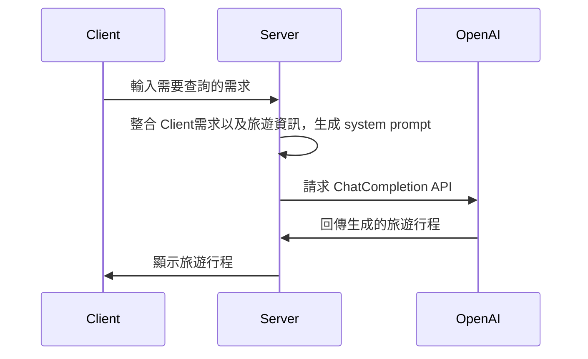

# Lab: 旅遊行程推薦達人

## Overview

::: info Feature 1
- 將旅遊資訊放入對話的上下文，由 Open AI ChatCompletion API 生成旅遊行程
:::

1. 給定旅遊資訊文字檔
2. 給定 system prompt
3. 將旅遊資訊放入對話的上下文，由 ChatCompletion API 生成旅遊行程。

::: info Feature 2
- 根據前台使用者輸入的 prompt，由 Assistants API 根據 Retrieval 檢索旅遊行程 json 檔案，推薦旅遊行程
:::

1. 給定特定的旅遊資訊 json 檔案
2. 使用者的輸入地點、時間、預算等旅遊資訊
3. 呼叫 Assistants API 根據特定的 json 推薦旅遊行程

::: info Feature 3
根據前台使用者輸入的 prompt，由 Assistants API 執行特定 action 取得實時 api 資料推薦旅遊行程
:::

1. 使用者的輸入地點、時間、預算等
2. 呼叫 Assistants API Open AI 執行特定 action 取得實時 api 資料推薦旅遊行程。

