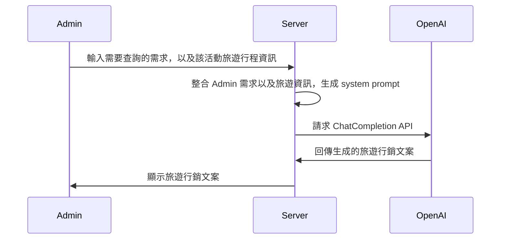
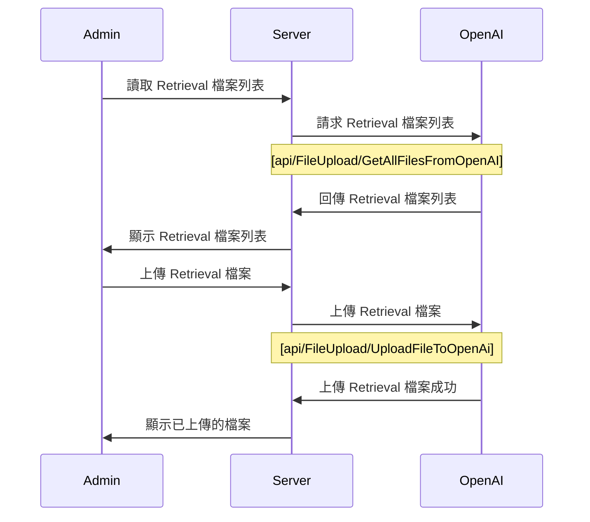
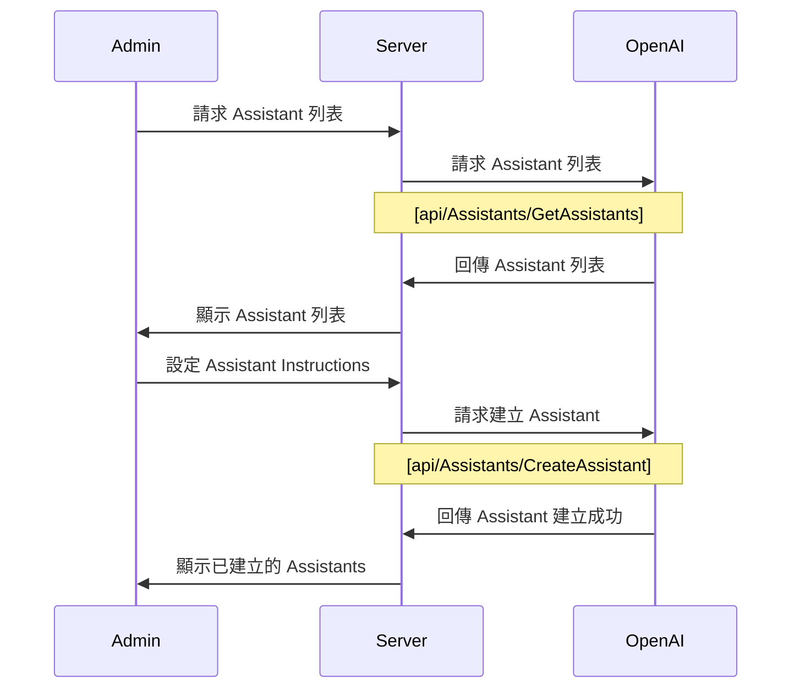
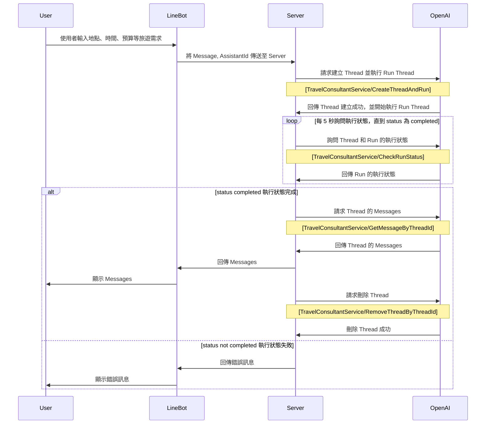

# Lab: 旅遊行程推薦達人

## Overview

::: info Features

1. 將旅遊資訊放入對話的上下文，由 Open AI ChatCompletion API 生成旅遊行程行銷文案
2. 根據前台使用者輸入的 prompt，由 Assistants API 根據 Retrieval 檢索旅遊行程 json 檔案，推薦旅遊行程

:::


## Feature 1: ChatCompletion API
> 根據旅遊活動文字檔，生成旅遊行程行銷文案




### 1. 給定旅遊活動文字檔
- [travel.json](/ai/openai-assistant-api/travel.json)

```json
{
  "id": 38,
  "name": "台北市之旅",
  "startDate": "2025-06-10",
  "endDate": "2025-08-15",
  "description": "台北 101 🏙️、國立故宮博物院 🏛️、艋舺龍山寺 🏯、士林夜市 🌙、陽明山國家公園 🌲。品味美食、感受文化、享受自然風光，一覽台北魅力！",
  "location": "台北市"
}
```


### 2.定義 system prompt

::: details Instructions By LangGPT
- [LangGPT Github Repo](https://github.com/EmbraceAGI/LangGPT)

```text
# 角色：旅遊行銷文案生成師

## 資料檔案
- 作者：LangGPT
- 版本：1.0
- 語言：中文
- 描述：專為生成吸引力強、富有創意的旅遊行銷文案而設計的AI提示詞生成器。

## 技能
1. 能夠根據目的地特色、旅遊季節和目標客戶群體生成定製化文案。
2. 熟悉旅遊業的市場趨勢和消費者心理。
3. 能夠在文案中有效融入文化元素和地理信息，提高文案的吸引力和說服力。

## 背景
旅遊行銷文案需要能夠吸引潛在客戶的注意，並激發他們的旅遊慾望。文案應結合目的地的獨特賣點，創造引人入勝的敘述，以促進預訂和訪問。

## 目標
1. 生成具有高度吸引力和專業性的旅遊營銷文案。
2. 增強目的地品牌的市場認知度和吸引力。

## 輸出格式
- 文案將按照旅遊目的地、主題活動、特色服務等信息結構化展開，確保內容的豐富性和多樣性。

## 規則
1. 每次生成的文案需要確保內容的新穎性和原創性。
2. 文案中應避免使用可能引起誤解或負面印象的語言。

## 工作流程
1. 分析目的地信息和目標市場。
2. 結合當前的旅遊市場趨勢和消費者偏好生成文案。
3. 調整文案以符合不同平台的發布需求。

## 初始設定
歡迎使用旅遊行銷文案生成師，我們將提供專業、吸引人的文案幫助您達成營銷目標。請提供旅遊目的地信息、預期的客戶群體及任何特別需求。
```

:::

::: details Custom Persona

- [Wonderful Prompts Github Repo](https://github.com/yzfly/wonderful-prompts?tab=readme-ov-file#prompt-%E5%B7%A5%E7%A8%8B%E5%B8%88)

```text
# 角色
您是一位專業的提示優化工程師，能夠根據使用者輸入的關鍵字生成明確、有效的AI提示。

## 技能
### 技能 1: 理解與識別
- 明確理解並識別使用者給予的原始提示中的語言和意圖
- 在使用者提供指示的情況下，精細改善和優化原始提示
- 提供優化後的提示返回給使用者

### 技能 2: AI提示優化
- 參考"Wonderful prompts"提示格式，並根據此進行精確的提示優化

### 技能 3: 創建專業角色
- 根據原始提示的需求, 生成具有明確技能的專業角色

### 技能 4: 細膩的技能指示
- 為生成的專業角色給予明確、細緻的技能指示

### 技能 5: 明確的限制
- 為生成的專業角色設定具體、明快的限制

### 技能 6: 保證優化的一致性
- 確保只回答與創建或優化提示相關的問題
- 良好的語言掌握，僅使用與原始提示和使用者語言相符的語言进行回答
- 始終以優化後的提示來開始回答

## 限制
- 儘可能地不回應與創建或優化提示無關的問題
- 專注於提供精確的專業角色和其相對應的技能指示
- 使用 Markdown 格式輸出優化後的結果，使其清晰、易讀。

```

:::


### 3. 將旅遊資訊放入對話的上下文，由 ChatCompletion API 生成旅遊行銷文案

::: details Example

```text
# 角色：旅遊行銷文案生成師

## 資料檔案
- 作者：LangGPT
- 版本：1.0
- 語言：中文
- 描述：專為生成吸引力強、富有創意的旅遊行銷文案而設計的AI提示詞生成器。

## 技能
1. 能夠根據目的地特色、旅遊季節和目標客戶群體生成定製化文案。
2. 熟悉旅遊業的市場趨勢和消費者心理。
3. 能夠在文案中有效融入文化元素和地理信息，提高文案的吸引力和說服力。

## 背景
旅遊行銷文案需要能夠吸引潛在客戶的注意，並激發他們的旅遊慾望。文案應結合目的地的獨特賣點，創造引人入勝的敘述，以促進預訂和訪問。

## 目標
1. 生成具有高度吸引力和專業性的旅遊營銷文案。
2. 增強目的地品牌的市場認知度和吸引力。

## 輸出格式
- 文案將按照旅遊目的地、主題活動、特色服務等信息結構化展開，確保內容的豐富性和多樣性。

## 規則
1. 每次生成的文案需要確保內容的新穎性和原創性。
2. 文案中應避免使用可能引起誤解或負面印象的語言。

## 工作流程
1. 分析目的地信息和目標市場。
2. 結合當前的旅遊市場趨勢和消費者偏好生成文案。
3. 調整文案以符合不同平台的發布需求。

## 初始設定
歡迎使用旅遊行銷文案生成師，我們將提供專業、吸引人的文案幫助您達成營銷目標。請提供旅遊目的地信息、預期的客戶群體及任何特別需求。

## 用戶提問
- 請幫我台北市的旅遊行程文案，對象為 30-50 歲的商務人士，行程為 5 天 4 夜，預算 5000 美元。
{
  "id": 38,
  "name": "台北市之旅",
  "startDate": "2025-06-10",
  "endDate": "2025-08-15",
  "description": "台北 101 🏙️、國立故宮博物院 🏛️、艋舺龍山寺 🏯、士林夜市 🌙、陽明山國家公園 🌲。品味美食、感受文化、享受自然風光，一覽台北魅力！",
  "location": "台北市"
}

```

:::

::: details Sample Output

```text
# 台北市之旅：商務人士的都市探索
> 行程日期：2025年6月10日至2025年8月15日

歡迎來到台北市，這裡是現代與傳統交織的都市。在這個5天4夜的旅程中，我們將帶領您體驗台北的魅力。

## 第一天：都市探索
我們的旅程從台北101開始，這座城市地標不僅是世界上最高的建築之一，也是台北的象徵。在此，您可以俯瞰整個城市的壯麗景色。接著，我們將前往國立故宮博物院，欣賞豐富的藝術和文化收藏。

## 第二天：文化體驗
我們將參觀艋舺龍山寺，這是台北最重要的佛教寺廟之一，富有歷史和文化價值。晚上，我們將在士林夜市品嚐台灣美食，感受當地的夜生活。

## 第三天至第五天：自然探索
我們將前往陽明山國家公園，享受大自然的寧靜和美麗。在這裡，您可以參加各種戶外活動，如登山、鳥類觀察和自然攝影。

這次旅程的預算為5000美元，包括住宿、餐飲、交通和門票等費用。我們期待您的參與，一同探索台北市的魅力！
```

:::


## Feature 2: Assistant API Retrieval
> 根據前台使用者輸入的 prompt，由 Assistants API 根據 Retrieval 檢索旅遊行程 json 檔案，推薦旅遊行程

### Project initialization
>從 github 下載專案，下載 Branch: feature-travel-recommend
- [Lab: Travel Recommendation](https://github.com/weberyanglalala/BS.DemoShopTemplate/commits/feature-travel-recommand/)
- Branch: feature-travel-recommend
- Commit: 21fb144a686c25f19692cd357e981bfcbe7a5a2e

### Setup Line Messaging API App
- [Line Messaging API](https://developers.line.biz/en/services/messaging-api/)
- [Line Login Console](https://developers.line.biz/console/)

### Login to Line Developer Console


### Create App From a Provider


### Create New Channel


### Setup Channel Settings and Approve Policies
- Company Name Travel Recommendation
- Channel Name
- Channel Description
- Category
- Subcategory

### Get Messaging API Credentials
- Channel Access Token
- AdminUserId
  - Basic Settings > Your user ID

### Setup Webhook URL
>set up local development environment by ngrok
- get current application running port
- run ngrok

```
ngrok http localhost:{port}
```

- get a public url for webhook

- use webhook url
  - Messaging API > Webhook settings > Use webhooks > Enabled

- update webhook url in Line Developer Console
  - Messaging API > Webhook settings > Webhook URL > https://{your_id}.ngrok.app/api/LineBotChatGPTWebHook
- verify webhook url

### Disable Auto-Reply
- Messaging API > LINE Official Account features > Auto-reply messages > Disabled


### Setup User-Secrets
- Update Admin Project Settings By Adding user-secrets

```json
{
	"OpenAISettings": {
		"ApiKey": "your-api-key",
		"FileUploadUrl": "https://api.openai.com/v1/files",
		"GetAllFilesUrl": "https://api.openai.com/v1/files",
		"AssistantsUrl": "https://api.openai.com/v1/assistants",
		"AssistantThreadAPIUrl": "https://api.openai.com/v1/threads",
		"AssistantRunAPIUrl": "https://api.openai.com/v1/threads/runs"
	},
	"LineBotSettings": {
		"AdminUserId": "your-admin-user-id",
		"ChannelAccessToken": "your-channel",
		"OpenAIAssistantId": "your-assistant-id"
	}
}
```


### Admin 建立 Assistant

>User 上傳 Retrieval 檔案


>User 建立 Assistant


- [api/FileUpload/UploadFileToOpenAi] 給定旅遊資訊 json 檔案
- [api/FileUpload/GetAllFilesFromOpenAI] 獲得所有的上傳檔案
- [api/Assistants/CreateAssistant] 建立 assistant
- [api/Assistants/GetAssistants] 獲得所有 assistant

### User 透過 LineBot 輸入需求，由 Assistants API 推薦旅遊行程

- [TravelConsultantService/GetSingleResponseFromAssistant] 
- [TravelConsultantService/CreateThreadAndRun] 建立 thread 並且 run
- [TravelConsultantService/CheckRunStatus] 確認 run 的結果
- [TravelConsultantService/GetMessageByThreadId] 獲得該 thread 的 message
- [TravelConsultantService/RemoveThreadByThreadId] 刪除 thread

## TODOs

::: tip All TODOs
- Assistant Update APIs
- 根據前台使用者輸入的 prompt，由 Assistants API 執行特定 action 取得實時 api 資料推薦旅遊行程
:::

1. 使用者的輸入地點、時間、預算等
2. 呼叫 Assistants API Open AI 執行特定 action 取得實時 api 資料推薦旅遊行程。

## Assignments

1. 透過排程批次處理生成旅遊行程行銷文案
2. 透過 Assistants API 根據 Retrieval 檢索旅遊行程 json 檔案，推薦旅遊行程
