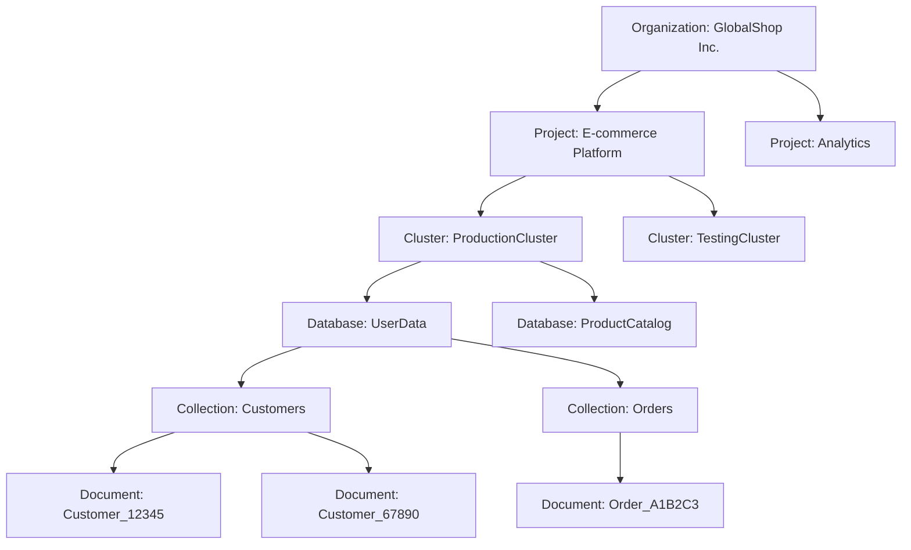

# Unit 01 Getting Started with MongoDB Atlas, the Developer Data Platform

> Atlas 是MongoDB提供的全託管雲服務，它簡化了 MongoDB 叢集的部署和管理，並提供了一個用於監控和優化性能的直觀界面。

1. Set up an Altas account
2. Deploy an Atlas cluster
3. Use the Data Explorer

### Atlas Cluster

- Organizations
  - Group and define users and teams
  - Grant access to projects
- Project
  - Define and organize resources

### MongoDB Atlas 中各個層級的階層關係：

- 最頂層是 Organization（組織）
- 每個 Organization 可以包含多個 Project（項目）
- 每個 Project 可以有多個 Cluster（叢集）
- 每個 Cluster 可以包含多個 Database（數據庫）
- 每個 Database 可以有多個 Collection（集合）
- 每個 Collection 可以包含多個 Document（文檔）

