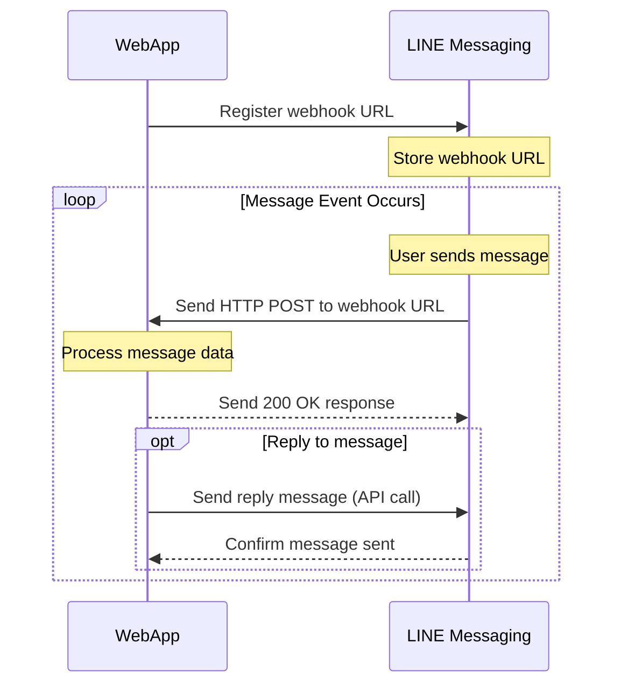

# Lab: Line Bot Chat with history

## Introduction

- Line Official Account
- Line Message API
- MongoDB
- Line Bot Webhook

## Prerequisites

- csproj

```xml

<ItemGroup>
    <PackageReference Include="LineBotSDK" Version="2.13.39"/>
    <PackageReference Include="Microsoft.EntityFrameworkCore" Version="8.0.8"/>
    <PackageReference Include="Microsoft.EntityFrameworkCore.Design" Version="8.0.8">
        <PrivateAssets>all</PrivateAssets>
        <IncludeAssets>runtime; build; native; contentfiles; analyzers; buildtransitive</IncludeAssets>
    </PackageReference>
    <PackageReference Include="Microsoft.EntityFrameworkCore.SqlServer" Version="8.0.8"/>
    <PackageReference Include="Microsoft.EntityFrameworkCore.Tools" Version="8.0.8">
        <IncludeAssets>runtime; build; native; contentfiles; analyzers; buildtransitive</IncludeAssets>
        <PrivateAssets>all</PrivateAssets>
    </PackageReference>
    <PackageReference Include="Microsoft.SemanticKernel" Version="1.21.1"/>
    <PackageReference Include="Microsoft.SemanticKernel.Connectors.MongoDB" Version="1.21.1-alpha"/>
    <PackageReference Include="Microsoft.SemanticKernel.Connectors.OpenAI" Version="1.21.1"/>
    <PackageReference Include="Microsoft.SemanticKernel.PromptTemplates.Handlebars" Version="1.21.1"/>
    <PackageReference Include="MongoDB.Driver" Version="2.29.0"/>
    <PackageReference Include="MongoDB.Bson" Version="2.29.0"/>
    <PackageReference Include="OpenAI" Version="2.0.0-beta.11"/>
    <PackageReference Include="Serilog.AspNetCore" Version="8.0.2"/>
    <PackageReference Include="Serilog.Sinks.Console" Version="6.0.0"/>
</ItemGroup>
```

- appsettings.json

```json
{
  "MongoDbSettings": {
    "ConnectionString": "",
    "VectorDatabaseName": "product-semantic-search",
    "VectorCollectionName": "products",
    "SearchIndexName": "default",
    "LineMessageDatabaseName": "line-mvc-sample"
  },
  "LineMessagingApiSettings": {
    "UserId": "",
    "ChannelAccessToken": ""
  }
}
```

## Set up Line Official Account and ngrok or dev tunnel for webhook

> https://hackmd.io/@weberyang0623/Bk24FjQJyl

> https://weberyanglalala.github.io/vitpress-dev-notes/ai/openai/travel-recommendation#setup-line-messaging-api-app

## Register Services in Program.cs

```csharp

builder.Services.AddScoped<MongoRepository>();

builder.Services
    .Configure<LineMessagingApiSettings>(builder.Configuration.GetSection(nameof(LineMessagingApiSettings)))
    .AddSingleton(settings => settings.GetRequiredService<IOptions<LineMessagingApiSettings>>().Value);

builder.Services.AddScoped<TravelChatServicePlugin>();
builder.Services.AddScoped<TravelChatService>(sp =>
{
    var kernelBuilder = Kernel.CreateBuilder();
    kernelBuilder.Services.AddOpenAIChatCompletion("gpt-4o-2024-08-06", builder.Configuration["OpenAIApiKey"]);
    var semanticProductSearchService = sp.GetRequiredService<SemanticProductSearchService>();
    kernelBuilder.Plugins.AddFromObject(new TravelChatServicePlugin(semanticProductSearchService));
    return new TravelChatService(kernelBuilder.Build());
});
builder.Services.AddScoped<LineMessageService>();

```

## LineMessagingApiSettings

####LineMessagingApiSettings.cs

```cs
public class LineMessagingApiSettings
{
    public string UserId { get; set; }
    public string ChannelAccessToken { get; set; }
}
```

### appsettings.json

```json
{
  // ...
  "LineMessagingApiSettings": {
      "UserId": "",
      "ChannelAccessToken": ""
    }
}
```

## MongoRepository.cs


::: details Click to see the code

```csharp
using Dotnet8DifyAgentSample.Models.MongoDB.Entities;
using Dotnet8DifyAgentSample.Settings;
using MongoDB.Driver;

namespace Dotnet8DifyAgentSample.Models.MongoDB;

public class MongoRepository
{
    private readonly IMongoCollection<User> _users;
    private readonly IMongoCollection<Conversation> _conversations;
    private readonly IMongoCollection<Message> _messages;
    private readonly IMongoClient _mongoClient;
    private readonly MongoDbSettings _settings;

    public MongoRepository(IMongoClient mongoClient, MongoDbSettings settings)
    {
        _mongoClient = mongoClient;
        _settings = settings;
        var database = _mongoClient.GetDatabase(_settings.LineMessageDatabaseName);
        _users = database.GetCollection<User>("Users");
        _conversations = database.GetCollection<Conversation>("Conversations");
        _messages = database.GetCollection<Message>("Messages");
    }

    public async Task CreateUserAsync(User user)
    {
        await _users.InsertOneAsync(user);
    }

    public async Task<User> GetUserByLineUserIdAsync(string lineUserId)
    {
        var filter = Builders<User>.Filter.Eq(u => u.LineUserId, lineUserId);
        return await _users.Find(filter).FirstOrDefaultAsync();
    }
    
    
    public async Task<User> GetUserAsync(string userId)
    {
        var filter = Builders<User>.Filter.Eq(u => u.UserId, userId);
        return await _users.Find(filter).FirstOrDefaultAsync();
    }

    public async Task<Conversation> CreateConversationByUserIdAsync(string userId, Conversation conversation)
    {
        conversation.UserId = userId;
        await _conversations.InsertOneAsync(conversation);
        return conversation;
    }
    
    public async Task<Conversation> GetConversationAsync(string conversationId)
    {
        var filter = Builders<Conversation>.Filter.Eq(c => c.ConversationId, conversationId);
        return await _conversations.Find(filter).FirstOrDefaultAsync();
    }
    
    public async Task<Conversation> UpdateConversationAsync(Conversation conversation)
    {
        var filter = Builders<Conversation>.Filter.Eq(c => c.ConversationId, conversation.ConversationId);
        await _conversations.ReplaceOneAsync(filter, conversation);
        return conversation;
    }

    public async Task<List<Conversation>> GetConversationsByUserIdAsync(string userId)
    {
        var filter = Builders<Conversation>.Filter.Eq(c => c.UserId, userId);
        var sort = Builders<Conversation>.Sort.Descending(c => c.CreateAt);
        return await _conversations.Find(filter).Sort(sort).ToListAsync();
    }
    
    public async Task<Conversation> GetLatestConversationByUserIdAsync(string userId)
    {
        var filter = Builders<Conversation>.Filter.Eq(c => c.UserId, userId);
        var sort = Builders<Conversation>.Sort.Descending(c => c.CreateAt);
        return await _conversations.Find(filter).Sort(sort).FirstOrDefaultAsync();
    }

    public async Task<Message> CreateMessageByConversationIdAsync(string conversationId, Message message)
    {
        message.ConversationId = conversationId;
        message.Timestamp = DateTime.UtcNow;
        await _messages.InsertOneAsync(message);
        return message;
    }

    public async Task<List<Message>> GetMessagesByConversationIdAsync(string conversationId)
    {
        var filter = Builders<Message>.Filter.Eq(m => m.ConversationId, conversationId);
        var sort = Builders<Message>.Sort.Ascending(m => m.Timestamp);
        return await _messages.Find(filter).Sort(sort).ToListAsync();
    }

    public async Task<Conversation> CreateConversationWithMessageAsync(string userId, Conversation conversation, Message message)
    {
        using var session = await _mongoClient.StartSessionAsync();
        session.StartTransaction();

        try
        {
            conversation.UserId = userId;
            await _conversations.InsertOneAsync(session, conversation);

            message.ConversationId = conversation.ConversationId;
            message.Timestamp = DateTime.UtcNow;
            await _messages.InsertOneAsync(session, message);

            await session.CommitTransactionAsync();
            return conversation;
        }
        catch (Exception)
        {
            await session.AbortTransactionAsync();
            throw;
        }
    }
}
```

::: 

## SemanticProductSearchService


::: details Code

```csharp
using System.Diagnostics.CodeAnalysis;
using Dotnet8DifyAgentSample.Models;
using Dotnet8DifyAgentSample.Services.ProductService;
using Dotnet8DifyAgentSample.Services.SemanticProductSearch.Dtos;
using Dotnet8DifyAgentSample.Settings;
using Microsoft.SemanticKernel.Connectors.MongoDB;
using Microsoft.SemanticKernel.Connectors.OpenAI;
using Microsoft.SemanticKernel.Memory;
using MongoDB.Driver;

namespace Dotnet8DifyAgentSample.Services.SemanticProductSearch;

[Experimental("SKEXP0020")]
public class SemanticProductSearchService
{
    private readonly ProductServiceByEFCore _productServiceByEFCore;
    private readonly MemoryBuilder _memoryBuilder;
    private readonly ISemanticTextMemory _semanticTextMemory;
    private readonly MongoDbSettings _mongoDbSettings;
    private readonly MongoDBMemoryStore _mongoDBMemoryStore;
    private readonly string _openAiApiKey;
    private readonly string _connectionString;
    private readonly string _searchIndexName;
    private readonly string _databaseName;
    private readonly string _collectionName;
    private readonly IMongoClient _mongoClient;
    private readonly ILogger<SemanticProductSearchService> _logger;

    public SemanticProductSearchService(MongoDbSettings mongoDbSettings, IMongoClient mongoClient,
        IConfiguration configuration, ILogger<SemanticProductSearchService> logger,
        ProductServiceByEFCore productServiceByEfCore)
    {
        // Initialize the openAI API key for text embedding generation
        _openAiApiKey = configuration["OpenAIApiKey"];
        // Initialize the mongodb settings: connection string, search index name, database name, collection name
        _mongoDbSettings = mongoDbSettings;
        _connectionString = _mongoDbSettings.ConnectionString;
        _searchIndexName = _mongoDbSettings.SearchIndexName;
        _databaseName = _mongoDbSettings.VectorDatabaseName;
        _collectionName = _mongoDbSettings.VectorCollectionName;
        // Initialize the memory store: MongoDBMemoryStore(or you can use other memory store like QdrantMemoryStore, etc.)
        _mongoDBMemoryStore = new MongoDBMemoryStore(_connectionString, _databaseName, _searchIndexName);
        // Initialize the memory builder: set up text embedding generation and memory store
        _memoryBuilder = new MemoryBuilder();
        _memoryBuilder.WithOpenAITextEmbeddingGeneration("text-embedding-ada-002", _openAiApiKey);
        _memoryBuilder.WithMemoryStore(_mongoDBMemoryStore);
        // Build the memory: create the semantic text memory
        _semanticTextMemory = _memoryBuilder.Build();
        _mongoClient = mongoClient;
        _logger = logger;
        _productServiceByEFCore = productServiceByEfCore;
    }

    public async Task<List<ProductSearchResult>> GetRecommendationsAsync(string userInput)
    {
        var memories = _semanticTextMemory.SearchAsync(_collectionName, userInput, limit: 10, minRelevanceScore: 0.6);

        var result = new List<ProductSearchResult>();
        await foreach (var memory in memories)
        {
            var productSearchResult = new ProductSearchResult
            {
                Id = memory.Metadata.Id,
                Description = memory.Metadata.Description,
                Name = memory.Metadata.AdditionalMetadata,
                Relevance = memory.Relevance.ToString("0.00")
            };
            result.Add(productSearchResult);
        }

        return result;
    }

    public async Task FetchAndSaveProductDocumentsAsync(int startIndex, int limitSize)
    {
        // Fetch and save product documents to the semantic text memory
        await FetchAndSaveProductDocuments(_semanticTextMemory, startIndex, limitSize);
    }

    private async Task FetchAndSaveProductDocuments(ISemanticTextMemory memory, int startIndex, int limitSize)
    {
        List<Product> products = _productServiceByEFCore.GetProductsByPageAsQueryable(startIndex, limitSize).ToList();
        foreach (var product in products)
        {
            try
            {
                _logger.LogInformation($"Processing {product.Id}, {product.Name}...");
                await memory.SaveInformationAsync(
                    collection: _collectionName,
                    text: product.Description,
                    id: product.Id.ToString(),
                    description: product.Description,
                    additionalMetadata: product.Name
                );
                _logger.LogInformation($"Done {product.Id}...");
            }
            catch (Exception ex)
            {
                _logger.LogError(ex.Message);
            }
        }
    }
}
```

:::

## TravelChatServicePlugin.cs


::: details Code

```cs
using System.ComponentModel;
using System.Diagnostics.CodeAnalysis;
using Dotnet8DifyAgentSample.Services.SemanticProductSearch;
using Dotnet8DifyAgentSample.Services.SemanticProductSearch.Dtos;
using Microsoft.SemanticKernel;

namespace Dotnet8DifyAgentSample.Services.SemanticKernel;

[Experimental("SKEXP0020")]
public class TravelChatServicePlugin
{
    private readonly SemanticProductSearchService _semanticProductSearchService;

    public TravelChatServicePlugin(SemanticProductSearchService semanticProductSearchService)
    {
        _semanticProductSearchService = semanticProductSearchService;
    }
    
    [KernelFunction("GetTravelRecommendationsByUserInput")]
    [Description("Get travel recommendations by user input")]
    public async Task<List<ProductSearchResult>> GetTravelRecommendationsByUserInput(
        [Description("The user input")] string userInput)
    {
        return await _semanticProductSearchService.GetRecommendationsAsync(userInput);
    }   
}
```

:::

## TravelChatService.cs


::: details Program.cs

```csharp
builder.Services.AddScoped<TravelChatServicePlugin>();
builder.Services.AddScoped<TravelChatService>(sp =>
{
    var kernelBuilder = Kernel.CreateBuilder();
    kernelBuilder.Services.AddOpenAIChatCompletion("gpt-4o-2024-08-06", builder.Configuration["OpenAIApiKey"]);
    var semanticProductSearchService = sp.GetRequiredService<SemanticProductSearchService>();
    kernelBuilder.Plugins.AddFromObject(new TravelChatServicePlugin(semanticProductSearchService));
    return new TravelChatService(kernelBuilder.Build());
});
```

:::

::: details TravelChatService.cs

```csharp
using Microsoft.SemanticKernel;
using Microsoft.SemanticKernel.ChatCompletion;
using Microsoft.SemanticKernel.Connectors.OpenAI;

namespace Dotnet8DifyAgentSample.Services.SemanticKernel;

public class TravelChatService
{
    private readonly Kernel _kernel;
    private readonly ChatHistory _chatHistory;
    private readonly IChatCompletionService _chatCompletionService;

    public TravelChatService(Kernel kernel)
    {
        _kernel = kernel;
        _chatHistory = new ChatHistory();
        string systemPrompt = """
                              # Role: Taiwan Travel Recommendation Expert
                              ## Profile
                              - Language: 繁體中文
                              - Description: 你是台灣旅遊推薦專家，擅長提供台灣各地旅遊景點、美食和文化活動的建議。
                              ## Skill-1
                              - 熟悉台灣各大旅遊景點及其特色。
                              - 能夠根據使用者的需求提供個性化的旅遊建議。
                              ## Skill-2
                              - 了解台灣的飲食文化，能夠推薦當地美食。
                              - 熟悉各種交通方式，能夠提供最佳路線建議。
                              ## Skill-3
                              - 根據提供的 Function GetTravelRecommendationsByUserInput 取得相關的旅遊資訊。
                              - 若是呼叫 GetTravelRecommendationsByUserInput Function 的回應，請回應參考格式如下
                              - 旅遊景點: {景點名稱}, Id: {景點編號}, 敘述: {景點敘述}, 網址: https://travel-recommendation/product/{景點Id編號}, 金額: {金額}
                              
                              ## 用戶歷史對談紀錄如下
                              """;
        _chatHistory.AddSystemMessage(systemPrompt);
        _chatCompletionService = _kernel.GetRequiredService<IChatCompletionService>();
    }

    public async Task<string> GetChatResponseByHistoryAndInput(string history, string input)
    {
        _chatHistory.AddSystemMessage(history);
        _chatHistory.AddUserMessage(input);
        var executionSettings = new OpenAIPromptExecutionSettings()
        {
            ToolCallBehavior = ToolCallBehavior.AutoInvokeKernelFunctions
        };
        var result = await _chatCompletionService.GetChatMessageContentAsync(_chatHistory, executionSettings, _kernel);
        return result.Content;
    }
}
```

:::

## LineMessageService.cs


::: details ProcessMessageAsync

```csharp
public async Task<string> ProcessMessageAsync(string lineUserId, string messageContent)
{
    // 確認使用者是否存在，若不存在新增一個
    var user = await CreateUserIfNotExisted(lineUserId);
    // 取得使用者 id，根據使用者 id 搜尋是否有存在的對話紀錄
    var (conversation, reminderMessage) = await GetOrCreateConversation(user.UserId);
    
    if (conversation == null)
    {
        // Handle the unexpected case where no conversation is returned
        return "取得對談紀錄失敗，請重新嘗試";
    }
    
    var summarization = conversation.Summarization ?? "目前沒有相關對話紀錄";
    // 將對話紀錄新增一筆訊息
    await CreateMessageByConversationIdAsync(conversation.ConversationId, messageContent, MessageType.User);
    // 根據對話紀錄的摘要和使用者輸入取得回應
    var chatResponse = await _travelChatService.GetChatResponseByHistoryAndInput(summarization, messageContent);
    // 將回應新增一筆訊息
    await CreateMessageByConversationIdAsync(conversation.ConversationId, chatResponse, MessageType.System);
    // 6. 更新對話紀錄的摘要
    await UpdateSummarization(conversation.ConversationId);
    // 7. 回傳訊息 If there's a reminder message, prepend it to the chat response
    if (!string.IsNullOrEmpty(reminderMessage))
    {
        chatResponse = $"{reminderMessage}{Environment.NewLine}{Environment.NewLine}{chatResponse}";
    }
    return chatResponse;
}
```

:::


::: details LineMessageService.cs

```csharp
using Dotnet8DifyAgentSample.Models.MongoDB;
using Dotnet8DifyAgentSample.Models.MongoDB.Entities;
using Dotnet8DifyAgentSample.Services.SemanticKernel;

namespace Dotnet8DifyAgentSample.Services.LineMessage;

public class LineMessageService
{
    private readonly MongoRepository _repository;
    private const int MaxMessagesPerConversation = 30; // 設定對話紀錄上限
    private readonly ChatSummarizationService _chatSummarizationService;
    private readonly TravelChatService _travelChatService;

    public LineMessageService(MongoRepository repository, ChatSummarizationService chatSummarizationService,
        TravelChatService travelChatService)
    {
        _repository = repository;
        _chatSummarizationService = chatSummarizationService;
        _travelChatService = travelChatService;
    }

    public async Task<string> ProcessMessageAsync(string lineUserId, string messageContent)
    {
        // 確認使用者是否存在，若不存在新增一個
        var user = await CreateUserIfNotExisted(lineUserId);
        // 取得使用者 id，根據使用者 id 搜尋是否有存在的對話紀錄
        var (conversation, reminderMessage) = await GetOrCreateConversation(user.UserId);
        
        if (conversation == null)
        {
            // Handle the unexpected case where no conversation is returned
            return "取得對談紀錄失敗，請重新嘗試";
        }
        
        var summarization = conversation.Summarization ?? "目前沒有相關對話紀錄";
        // 將對話紀錄新增一筆訊息
        await CreateMessageByConversationIdAsync(conversation.ConversationId, messageContent, MessageType.User);
        // 根據對話紀錄的摘要和使用者輸入取得回應
        var chatResponse = await _travelChatService.GetChatResponseByHistoryAndInput(summarization, messageContent);
        // 將回應新增一筆訊息
        await CreateMessageByConversationIdAsync(conversation.ConversationId, chatResponse, MessageType.System);
        // 6. 更新對話紀錄的摘要
        await UpdateSummarization(conversation.ConversationId);
        // 7. 回傳訊息 If there's a reminder message, prepend it to the chat response
        if (!string.IsNullOrEmpty(reminderMessage))
        {
            chatResponse = $"{reminderMessage}{Environment.NewLine}{Environment.NewLine}{chatResponse}";
        }
        return chatResponse;
    }

    private async Task<Conversation> UpdateSummarization(string conversationId)
    {
        var conversation = await _repository.GetConversationAsync(conversationId);
        if (conversation.Summarization is null)
        {
            conversation.Summarization = "目前沒有相關對話紀錄";
        }
        else
        {
            var latestMessages = await _repository.GetMessagesByConversationIdAsync(conversationId);
            var chatHistory = latestMessages.Select(m => $"{m.MessageType.ToString()} > {m.Content}").ToList();
            var stringChatHistory = string.Join(Environment.NewLine, chatHistory);
            var newSummarization = await _chatSummarizationService.GetSummarization(stringChatHistory);
            conversation.Summarization = newSummarization;
        }

        await _repository.UpdateConversationAsync(conversation);
        return conversation;
    }

    private async Task<User> CreateUserIfNotExisted(string lineUserId)
    {
        var user = await _repository.GetUserByLineUserIdAsync(lineUserId);
        if (user == null)
        {
            user = new User { LineUserId = lineUserId, CreateAt = DateTime.Now };
            await _repository.CreateUserAsync(user);
        }

        return user;
    }

    private async Task<(Conversation? Conversation, string? ReminderMessage)> GetOrCreateConversation(string userId)
    {
        var latestConversation = await _repository.GetLatestConversationByUserIdAsync(userId);

        if (latestConversation == null)
        {
            // If there's no conversation, create a new one
            var newConversation = await CreateConversationByUserId(userId);
            return (newConversation, null);
        }

        if (await IsConversationFull(latestConversation.ConversationId))
        {
            // If the conversation is full, create a new one and return a reminder message
            var newConversation = await CreateConversationByUserId(userId);
            string reminderMessage = "目前對話紀錄已滿，已建立新的對話紀錄。";
            return (newConversation, reminderMessage);
        }

        // If the conversation exists and is not full, return it without a reminder message
        return (latestConversation, null);
    }

    private async Task<bool> IsConversationFull(string conversationId)
    {
        var messages = await _repository.GetMessagesByConversationIdAsync(conversationId);
        return messages.Count >= MaxMessagesPerConversation;
    }

    private async Task<Conversation> CreateConversationByUserId(string userId)
    {
        var conversation = new Conversation { UserId = userId, CreateAt = DateTime.Now };
        await _repository.CreateConversationByUserIdAsync(userId, conversation);
        return conversation;
    }

    private async Task<Message> CreateMessageByConversationIdAsync(string conversationId, string messageContent,
        MessageType messageType)
    {
        var message = new Message
        {
            MessageType = messageType,
            Content = messageContent,
            Timestamp = DateTime.UtcNow
        };
        var result = await _repository.CreateMessageByConversationIdAsync(conversationId, message);
        return result;
    }
}
```

:::

## ChatController.cs




::: details Code

```csharp
using Dotnet8DifyAgentSample.Services.LineMessage;
using Dotnet8DifyAgentSample.Settings;
using isRock.LineBot;
using Microsoft.AspNetCore.Mvc;

namespace Dotnet8DifyAgentSample.WebApi;

public class ChatController : LineWebHookControllerBase
{
    private readonly string _adminUserId;
    private readonly Bot _bot;
    private readonly LineMessageService _lineMessageService;

    public ChatController(LineMessagingApiSettings lineMessagingApiSettingsSettings, LineMessageService lineMessageService)
    {
        _lineMessageService = lineMessageService;
        _adminUserId = lineMessagingApiSettingsSettings.UserId;
        ChannelAccessToken = lineMessagingApiSettingsSettings.ChannelAccessToken;
        _bot = new Bot(ChannelAccessToken);
    }

    [Route("api/LineBotChatWebHook")]
    public async Task<IActionResult> GetChatResult()
    {
        try
        {
            if (IsLineVerify()) return Ok();
            foreach (var lineEvent in ReceivedMessage.events)
            {
                var lineUserId = lineEvent.source.userId;
                _bot.DisplayLoadingAnimation(lineEvent.source.userId, 20);
                var responseMessage = await _lineMessageService.ProcessMessageAsync(lineUserId, lineEvent.message.text);
                _bot.ReplyMessage(lineEvent.replyToken, responseMessage);
            }
        }
        catch (Exception ex)
        {
            Console.WriteLine(ex.Message);
            _bot.PushMessage(_adminUserId, "系統忙碌中，請稍後再試。");
            return Ok();
        }

        return Ok();
    }

    private bool IsLineVerify()
    {
        return ReceivedMessage.events == null || ReceivedMessage.events.Count() <= 0 ||
               ReceivedMessage.events.FirstOrDefault().replyToken == "00000000000000000000000000000000";
    }
}
```

::: 
