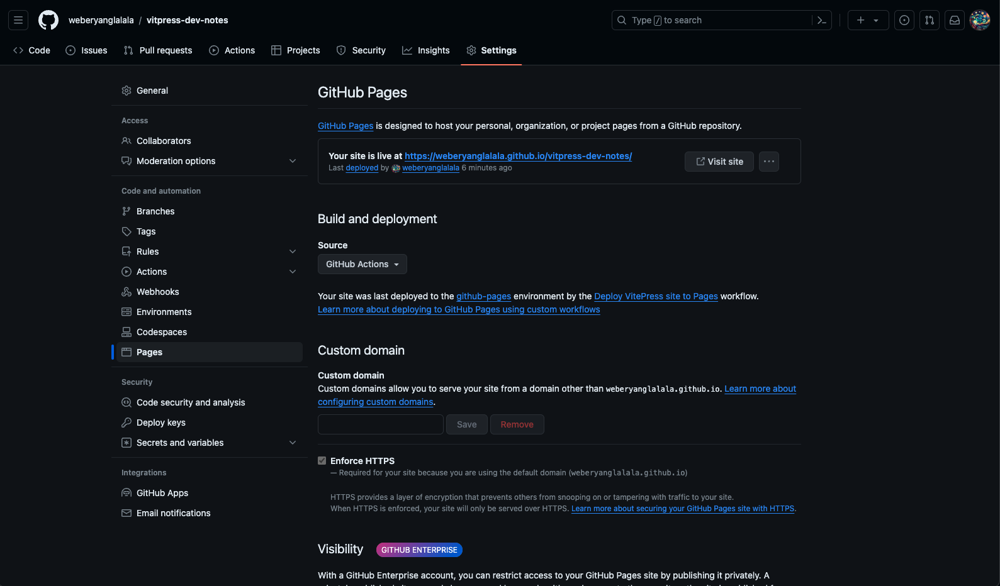
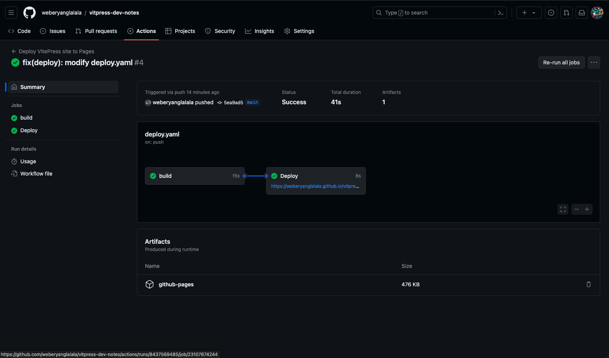

# 透過 GitHub 部署 VitePress 站台
## 步驟 1: 在你的項目中啟用 GitHub Pages
- 首先，需要在 GitHub 儲存庫的設置中啟用 GitHub Pages 功能。
- 這通常在設置的 "Pages" 部分完成。確保選擇 "GitHub Actions" 作為你的部署源。



## 步驟 2: 創建 GitHub Actions 工作流程
- [VitPress Deploy Guide](https://vitepress.dev/guide/deploy#github-pages)
- 在你的專案中創建一個名為 `.github/workflows/deploy.yml` 的文件。

```yaml
# Sample workflow for building and deploying a VitePress site to GitHub Pages
#
name: Deploy VitePress site to Pages

on:
  # Runs on pushes targeting the `main` branch. Change this to `master` if you're
  # using the `master` branch as the default branch.
  push:
    branches: [main]

  # Allows you to run this workflow manually from the Actions tab
  workflow_dispatch:

# Sets permissions of the GITHUB_TOKEN to allow deployment to GitHub Pages
permissions:
  contents: read
  pages: write
  id-token: write

# Allow only one concurrent deployment, skipping runs queued between the run in-progress and latest queued.
# However, do NOT cancel in-progress runs as we want to allow these production deployments to complete.
concurrency:
  group: pages
  cancel-in-progress: false

jobs:
  # Build job
  build:
    runs-on: ubuntu-latest
    steps:
      - name: Checkout
        uses: actions/checkout@v4
        with:
          fetch-depth: 0 # Not needed if lastUpdated is not enabled
      # - uses: pnpm/action-setup@v3 # Uncomment this if you're using pnpm
      # - uses: oven-sh/setup-bun@v1 # Uncomment this if you're using Bun
      - name: Setup Node
        uses: actions/setup-node@v4
        with:
          node-version: 20
          cache: npm # or pnpm / yarn
      - name: Setup Pages
        uses: actions/configure-pages@v4
      - name: Install dependencies
        run: npm ci # or pnpm install / yarn install / bun install
      - name: Build with VitePress
        run: npm run docs:build # or pnpm docs:build / yarn docs:build / bun run docs:build
      - name: Upload artifact
        uses: actions/upload-pages-artifact@v3
        with:
          path: docs/.vitepress/dist

  # Deployment job
  deploy:
    environment:
      name: github-pages
      url: ${{ steps.deployment.outputs.page_url }}
    needs: build
    runs-on: ubuntu-latest
    name: Deploy
    steps:
      - name: Deploy to GitHub Pages
        id: deployment
        uses: actions/deploy-pages@v4
```

## 步驟 3: 當 push 到 main 分支時，GitHub Actions 會自動部署站台

